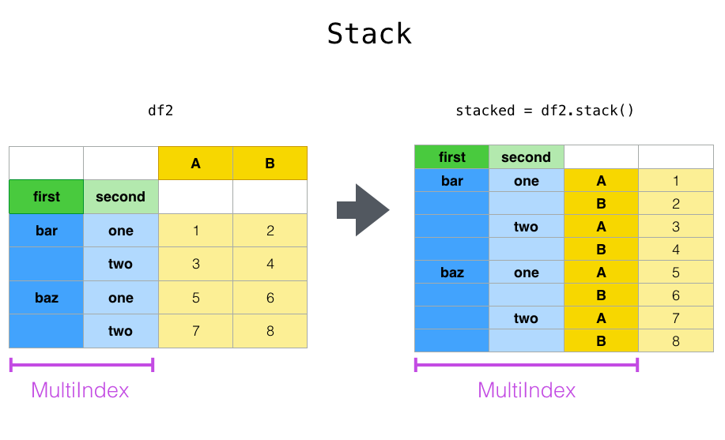
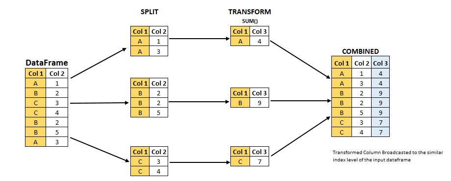

Pandas
======

.. questions::

   - 1
   - 2

.. objectives::

   - 1
   - 2
   - 3

Pandas is a Python package that provides high-performance and easy to use 
data structures and data analysis tools. Build on numpy array, pandas is 
particularly well suited to analyze tabular and time series data. 
Although numpy could deal with structured array (array with mixed data types), it is not efficient. 

The core data structures of pandas are series and dataframe. 
A pandas series is a one-dimensional numpy array with an index 
which we could use to access the data, 
while dataframe consists of a table of values with lables for each row and column.  
A dataframe can combine multiple data types, such as numbers and text, 
but the data in each column is of the same type.

.. image:: img/01_table_dataframe.svg

Each column of a dataframe is a `series object <https://pandas.pydata.org/docs/user_guide/dsintro.html#series>`__ - a dataframe is thus a collection of series.

pre-processing
--------------

In real applications, some data pre-processing have to be performed before one can perform useful analysis.
There is no fixed list of what these pre-processings are, but in general the following steps are involved:

- data cleaning
- data reshaping
- data 

First step is to load pandas::

    import pandas as pd

data cleaning
-------------

A couple of essential  data cleaning processes include but not limited to the following:

- data renaming
- data reordering
- data type converting
- handling of duplicating data, missing data, invalid data

add examples 
https://pandas.pydata.org/docs/user_guide/missing_data.html

data Reshaping
--------------

Once data cleaning is done, we will reach the data reshaping phase. By reorganising the data, one could make the subsequent data operations easier.

tidy data format
................

Let's first look at the following two tables:

.. challenge:: 1500m Running event

   .. tabs:: 

      .. tab:: untidy data format

             .. code-block:: py

			     Runner  400  800  1200  1500
			0  Runner 1   64  128   192   240
			1  Runner 2   80  160   240   300
			2  Runner 3   96  192   288   360

      .. tab:: tidy data format

             .. code-block:: python

			      Runner distance  time
			0   Runner 1      400    64
			1   Runner 2      400    80
			2   Runner 3      400    96
			3   Runner 1      800   128
			4   Runner 2      800   160
			5   Runner 3      800   192
			6   Runner 1     1200   192
			7   Runner 2     1200   240
			8   Runner 3     1200   288
			9   Runner 1     1500   240
			10  Runner 2     1500   300
			11  Runner 3     1500   360

Most tabular data is either in a tidy format or a untidy format (some people refer them as the long format or the wide format). 

In short, 
in an untidy (wide) format, each row represents an observation 
consisting of multiple variables and each variable has its own column. 
This is very intuitive and easy for us (human beings) to understand 
and  make comparisons across different variables, calculate statistics, etc.  
In a tidy (long) format , i.e. column-oriented format, each row represents 
only one variable of the observation, and can be considered "computer readable".

Both formats have their own merits and you need to know which one suits your analysis.
For example, if you are dealing with matrices, you would not want to store them as rows and columns, 
but as a two-dimensional array using untidy format. On the other hand, if you need to add new data  
or remove old data frequently from the table in a relational database, the tidy format may be the choice. 
Another case is that there are certain visualization tools which take data in the tidy format, e,g, ggplot, seaborn.

When it comes to data analysis using pandas, the tidy format is recommended: 
- each column can be stored as a vector and this not only saves memory 
but also allows for vectorized calculations which are much faster.
- it's easier to filter, group, join and aggregate the data

.. note:: 

The name "tidy data" comes from Wickham’s paper (2014) which describes the ideas in great detail.

pivoting
........

Create a data frame first

.. code:: python

df = pd.DataFrame(
    {
        "foo": ["one", "one", "one", "two", "two", "two"] ,
        "bar": ["A", "B", "C"] * 2,
        "baz": np.linspace(1,6,6).astype(int),
        "zoo": ["x","y","z","q","w","t"]
    }
)

To select out everything for variable ``A`` we could do:

.. code:: python

   filtered = df[df["bar"] == "A"]
   filtered

But suppose we would like to represent the table in such a way that
the ``columns`` are the unique variables from 'bar' and the ``index`` from 'foo'. 
To reshape the data into this form, we use the :meth:`DataFrame.pivot` method (also implemented as a
top level function :func:`~pandas.pivot`):

.. code:: python

   pivoted = df.pivot(index="foo", columns="bar", values="baz")
   pivoted

.. image:: img/reshaping_pivot.png

If the ``values`` argument is omitted, and the input :class:`DataFrame` has more than
one column of values which are not used as column or index inputs to :meth:`~DataFrame.pivot`,
then the resulting "pivoted" :class:`DataFrame` will have :ref:`hierarchical columns
<advanced.hierarchical>` whose topmost level indicates the respective value
column:

.. code:: python

   df["value2"] = df["value"] * 2
   pivoted = df.pivot(index="date", columns="variable")
   pivoted

You can then select subsets from the pivoted :class:`DataFrame`:

.. code:: python

   pivoted["value2"]

Note that this returns a view on the underlying data in the case where the data
are homogeneously-typed.

.. note::
   :func:`~pandas.pivot` will error with a ``ValueError: Index contains duplicate
   entries, cannot reshape`` if the index/column pair is not unique. In this
   case, consider using :func:`~pandas.pivot_table` which is a generalization
   of pivot that can handle duplicate values for one index/column pair.

stacking and unstacking
.......................

Closely related to the pivot() method are the related stack() and unstack() methods available on Series and DataFrame. 
These methods are designed to work together with MultiIndex objects.

The stack() function "compresses" a level in the DataFrame columns to produce either:
    A Series, in the case of a simple column Index.
    A DataFrame, in the case of a MultiIndex in the columns.

If the columns have a MultiIndex, you can choose which level to stack. The stacked level becomes the new lowest level in a MultiIndex on the columns:

.. code:: python

tuples = list(
    zip(
        *[
            ["bar", "bar", "baz", "baz", "foo", "foo", "qux", "qux"],
            ["one", "two", "one", "two", "one", "two", "one", "two"],
        ]
    )
)

columns = pd.MultiIndex.from_tuples(
    [
        ("bar", "one"),
        ("bar", "two"),
        ("baz", "one"),
        ("baz", "two"),
        ("foo", "one"),
        ("foo", "two"),
        ("qux", "one"),
        ("qux", "two"),
    ],
    names=["first", "second"]
)

index = pd.MultiIndex.from_tuples(tuples, names=["first", "second"])

Note: there are other ways to generate MultiIndex, e.g. 

.. code:: python

index = pd.MultiIndex.from_product(
    [("bar", "baz", "foo", "qux"), ("one", "two")], names=["first", "second"]
)

df = pd.DataFrame(np.linspace(1,16,16).astype(int).reshape(8,2), index=index, columns=["A", "B"])
df
df2 = df[:4]
df2

stacked=df2.stack()

The unstack() method performs the inverse operation of stack(), and by default unstacks the last level.
If the indexes have names, you can use the level names instead of specifying the level numbers.

stacked.unstack()

.. image:: img/reshaping_unstack.png 

stacked.unstack(1)
or 
stacked.unstack("second")

.. image:: img/reshaping_unstack_1.png 

.. image:: img/reshaping_unstack_0.png 

groupby
-------

data aggregation
................

As we know, when it is about  mathematical oprations on arrays of numerical data, Numpy does best.
Pandas works very well with numpy when aggregating dataframes.

add this somewhere
Always check whether NumPy already has a function before implementing one yourself.
most of what we would want to write ourselves has already been built

Before we dive into any calculations, let's make sure that our data won't be displayed
in scientific notation. We will modify how floats are formatted for displaying. The
format we will apply is .2f , which will provide the float with two digits after the
decimal point:
>> pd.set_option('display.float_format', lambda x: '%.2f' % x)

Pandas has a strong built-in understanding of time. With datasets indexed by a pandas DateTimeIndex, we can easily group and resample the data using common time units.

The groupby() method is an amazingly powerful function in pandas. But it is also complicated to use and understand.
Together with pivot() / stack() / unstack() and the basic Series and DataFrame statistical functions, groupby can produce some very expressive and fast data manipulations.

The workflow of groubpy method can be divided into three general steps:

    1.Splitting: Partition the data into different groups based on some criterion.
    2.Applying: Do some caclulation within each group. Different kinds of calulations might be aggregation, transformation, filtration
    3.Combining: Put the results back together into a single object.

import urllib.request
import pandas as pd

header_url = 'ftp://ftp.ncdc.noaa.gov/pub/data/uscrn/products/daily01/HEADERS.txt'
with urllib.request.urlopen(header_url) as response:
    data = response.read().decode('utf-8')
lines = data.split('\n')
headers = lines[1].split(' ')

ftp_base = 'ftp://ftp.ncdc.noaa.gov/pub/data/uscrn/products/daily01/'
dframes = []
for year in range(2016, 2019):
    data_url = f'{year}/CRND0103-{year}-NY_Millbrook_3_W.txt'               
    df = pd.read_csv(ftp_base + data_url, parse_dates=[1],
                     names=headers,header=None, sep='\s+',
                     na_values=[-9999.0, -99.0])
    dframes.append(df)

df = pd.concat(dframes)
df = df.set_index('LST_DATE')

df.head()

df['T_DAILY_MEAN'] # or df.T_DAILY_MEAN

df['T_DAILY_MEAN'].aggregate([np.max,np.min,np.mean])

df.index
df.index is a pandas DateTimeIndex object.

An obvious one is aggregation via the aggregate() or equivalently agg() method:

gbyear=df.groupby(df.index.year)
gbyear.T_DAILY_MEAN.head()
gbyear.T_DAILY_MEAN.max()
gbyear.T_DAILY_MEAN.aggregate(np.max)
gbyear.T_DAILY_MEAN.aggregate([np.min, np.max, np.mean, np.std])

now let us calculate the monthly mean values
gb=df.groupby(df.index.month)

df.groupby('T_DAILY_MEAN')  or df.groupby(df.T_DAILY_MEAN)

monthly_climatology = df.groupby(df.index.month).mean()
monthly_climatology
Each row in this new dataframe respresents the average values for the months (1=January, 2=February, etc.)

monthly_T_climatology = df.groupby(df.index.month).aggregate({'T_DAILY_MEAN': 'mean',
                                                              'T_DAILY_MAX': 'max',
                                                              'T_DAILY_MIN': 'min'})
monthly_T_climatology.head()

daily_T_climatology = df.groupby(df.index.dayofyear).aggregate({'T_DAILY_MEAN': 'mean',
                                                            'T_DAILY_MAX': 'max',
                                                            'T_DAILY_MIN': 'min'})

def standardize(x):
    return (x - x.mean())/x.std()

anomaly = df.groupby(df.index.month).transform(standardize)

data transfromation
........................

The key difference between aggregation and transformation is that aggregation returns a smaller object than the original, indexed by the group keys, while transformation returns an object with the same index (and same size) as the original object. 

In this example, we standardize the temperature so that the distribution has zero mean and unit variance. We do this by first defining a function called standardize and then passing it to the transform method.

transformed = df.groupby(lambda x: x.year).transform(
    lambda x: (x - x.mean()) / x.std()
)

grouped = df.groupby(lambda x: x.year)

grouped_trans = transformed.groupby(lambda x: x.year)

Clearly, pandas dataframes allows us to do advanced analysis with very few commands, but it takes a while to get used to how dataframes work so let's get back to basics.

.. callout:: Getting help

    Series and DataFrames have a lot functionality, but
    how can we find out what methods are available and how they work? One way is to visit 
    the `API reference <https://pandas.pydata.org/docs/reference/frame.html>`__ 
    and reading through the list. 
    Another way is to use the autocompletion feature in Jupyter and type e.g. 
    ``titanic["Age"].`` in a notebook and then hit ``TAB`` twice - this should open 
    up a list menu of available methods and attributes.

    Jupyter also offers quick access to help pages (docstrings) which can be 
    more efficient than searching the internet. Two ways exist:

    - Write a function name followed by question mark and execute the cell, e.g.
      write ``titanic.hist?`` and hit ``SHIFT + ENTER``.
    - Write the function name and hit ``SHIFT + TAB``.

What's in a dataframe?
----------------------

However, the rows also have names! This is what Pandas calls the **index**::

    titanic.index

Exercises 1
-----------

.. challenge:: Exploring dataframes

    - Have a look at the available methods and attributes using the 
      `API reference <https://pandas.pydata.org/docs/reference/frame.html>`__ 
      or the autocomplete feature in Jupyter. 
    - Try out a few methods using the Titanic dataset and have a look at 
      the docstrings (help pages) of methods that pique your interest
    - Compute the mean age of the first 10 passengers by slicing and the ``mean`` method
    - (Advanced) Using boolean indexing, compute the survival rate 
      (mean of "Survived" values) among passengers over and under the average age.
    
.. solution:: 

    - Mean age of the first 10 passengers: ``titanic.iloc[:10,:]["Age"].mean()`` 
      or ``titanic.loc[:9,"Age"].mean()`` or ``df.iloc[:10,5].mean()``.
    - Survival rate among passengers over and under average age: 
      ``titanic[titanic["Age"] > titanic["Age"].mean()]["Survived"].mean()`` and 
      ``titanic[titanic["Age"] < titanic["Age"].mean()]["Survived"].mean()``.

Tidy data
---------

The above analysis was rather straightforward thanks to the fact 
that the dataset is *tidy*.

.. image:: img/pandas/tidy_data.png

In short, columns should be variables and rows should be measurements, 
and adding measurements (rows) should then not require any changes to code 
that reads the data.

What would untidy data look like? Here's an example from 
some run time statistics from a 1500 m running event::

    runners = pd.DataFrame([
                  {'Runner': 'Runner 1', 400: 64, 800: 128, 1200: 192, 1500: 240},
                  {'Runner': 'Runner 2', 400: 80, 800: 160, 1200: 240, 1500: 300},
                  {'Runner': 'Runner 3', 400: 96, 800: 192, 1200: 288, 1500: 360},
              ])

What makes this data untidy is that the column names `400, 800, 1200, 1500`
indicate the distance ran. In a tidy dataset, this distance would be a variable
on its own, making each runner-distance pair a separate observation and hence a
separate row.

To make untidy data tidy, a common operation is to "melt" it, 
which is to convert it from wide form to a long form::

    runners = pd.melt(df, id_vars="Runner", 
                  value_vars=[400, 800, 1200, 1500], 
                  var_name="distance", 
                  value_name="time"
              )

In this form it's easier to **filter**, **group**, **join** 
and **aggregate** the data, and it's also easier to model relationships 
between variables.

The opposite of melting is to *pivot* data, which can be useful to 
view data in different ways as we'll see below.

For a detailed exposition of data tidying, have a look at 
`this article <http://vita.had.co.nz/papers/tidy-data.pdf>`__.

Working with dataframes
-----------------------

We saw above how we can read in data into a dataframe using the ``read_csv`` method.
Pandas also understands multiple other formats, for example using ``read_excel``,  
``read_hdf``, ``read_json``, etc. (and corresponding methods to write to file: 
``to_csv``, ``to_excel``, ``to_hdf``, ``to_json``, etc.)  

But sometimes you would want to create a dataframe from scratch. Also this can be done 
in multiple ways, for example starting with a numpy array::

    dates = pd.date_range('20130101', periods=6)
    df = pd.DataFrame(np.random.randn(6, 4), index=dates, columns=list('ABCD'))

or a dictionary::

    df = pd.DataFrame({'A': ['foo', 'bar', 'foo', 'bar', 'foo', 'bar', 'foo', 'foo'],
                       'B': ['one', 'one', 'two', 'three', 'two', 'two', 'one', 'three'],
                       'C': np.array([3] * 8, dtype='int32'),
                       'D': np.random.randn(8),
                       'E': np.random.randn(8)})

There are many ways to operate on dataframes. Let's look at a 
few examples in order to get a feeling of what's possible
and what the use cases can be.

We can easily split and concatenate or append dataframes::

    sub1, sub2, sub3 = df[:2], df[2:4], df[4:]
    pd.concat([sub1, sub2, sub3])
    sub1.append([sub2, sub3])      # same as above

When pulling data from multiple dataframes, a powerful ``merge()`` method is
available that acts similarly to merging in SQL. Say we have a dataframe containing the age of some athletes::

    age = pd.DataFrame([
        {"Runner": "Runner 4", "Age": 18},
        {"Runner": "Runner 2", "Age": 21},
        {"Runner": "Runner 1", "Age": 23},
        {"Runner": "Runner 3", "Age": 19},
    ])

We now want to use this table to annotate the original ``runners`` table from
before with their age. Note that the ``runners`` and ``age`` dataframes have a
different ordering to it, and ``age`` has an entry for ``Dave`` which is not
present in the ``runners`` table. We can let Pandas deal with all of it using
the ``.merge()`` method::

    # Add the age for each runner
    runners.merge(age, on="Runner")

In fact, much of what can be done in SQL 
`is also possible with pandas <https://pandas.pydata.org/docs/getting_started/comparison/comparison_with_sql.html>`__.

``groupby()`` is a powerful method which splits a dataframe and aggregates data
in groups. To see what's possible, let's return to the Titanic dataset. Let's
test the old saying "Women and children first". We start by creating a new
column ``Child`` to indicate whether a passenger was a child or not, based on
the existing ``Age`` column. For this example, let's assume that you are a
child when you are younger than 12 years::

    titanic["Child"] = titanic["Age"] < 12

Now we can test the saying by grouping the data on ``Sex`` and then creating further sub-groups based on ``Child``::

    titanic.groupby(["Sex", "Child"])["Survival"].mean()

Here we chose to summarize the data by its mean, but many other common
statistical functions are available as dataframe methods, like
``std()``, ``min()``, ``max()``, ``cumsum()``, ``median()``, ``skew()``,
``var()`` etc. 

Exercises 2
-----------

.. challenge:: Analyze the Titanic passenger list dataset

    In the Titanic passenger list dataset, 
    investigate the family size of the passengers (i.e. the "SibSp" column).

    - What different family sizes exist in the passenger list? Hint: try the `unique` method 
    - What are the names of the people in the largest family group?
    - (Advanced) Create histograms showing the distribution of family sizes for 
      passengers split by the fare, i.e. one group of high-fare passengers (where 
      the fare is above average) and one for low-fare passengers 
      (Hint: instead of an existing column name, you can give a lambda function
      as a parameter to ``hist`` to compute a value on the fly. For example
      ``lambda x: "Poor" if df["Fare"].loc[x] < df["Fare"].mean() else "Rich"``).

.. solution:: Solution

    - Existing family sizes: ``df["SibSp"].unique()``
    - Names of members of largest family(ies): ``df[df["SibSp"] == 8]["Name"]``
    - ``df.hist("SibSp", lambda x: "Poor" if df["Fare"].loc[x] < df["Fare"].mean() else "Rich", rwidth=0.9)``

Time series superpowers
-----------------------

An introduction of pandas wouldn't be complete without mention of its 
special abilities to handle time series. To show just a few examples, 
we will use a new dataset of Nobel prize laureates::

    nobel = pd.read_csv("http://api.nobelprize.org/v1/laureate.csv")
    nobel.head()

This dataset has three columns for time, "born"/"died" and "year". 
These are represented as strings and integers, respectively, and 
need to be converted to datetime format::

    # the errors='coerce' argument is needed because the dataset is a bit messy
    nobel["born"] = pd.to_datetime(nobel["born"], errors ='coerce')
    nobel["died"] = pd.to_datetime(nobel["died"], errors ='coerce')
    nobel["year"] = pd.to_datetime(nobel["year"], format="%Y")

Pandas knows a lot about dates::

    print(nobel["born"].dt.day)
    print(nobel["born"].dt.year)
    print(nobel["born"].dt.weekday)
    
We can add a column containing the (approximate) lifespan in years rounded 
to one decimal::

    nobel["lifespan"] = round((nobel["died"] - nobel["born"]).dt.days / 365, 1)

and then plot a histogram of lifespans::

    nobel.hist(column='lifespan', bins=25, figsize=(8,10), rwidth=0.9)
    
Finally, let's see one more example of an informative plot 
produced by a single line of code::

    nobel.boxplot(column="lifespan", by="category")

Exercises 3
-----------

.. challenge:: Analyze the Nobel prize dataset

    - What country has received the largest number of Nobel prizes, and how many?
      How many countries are represented in the dataset? Hint: use the `describe()` method
      on the ``bornCountryCode`` column.
    - Create a histogram of the age when the laureates received their Nobel prizes.
      Hint: follow the above steps we performed for the lifespan. 
    - List all the Nobel laureates from your country.

    Now more advanced steps:
    
    - Now define an array of 4 countries of your choice and extract 
      only laureates from these countries::
      
          countries = np.array([COUNTRY1, COUNTRY2, COUNTRY3, COUNTRY4])
          subset = nobel.loc[nobel['bornCountry'].isin(countries)]

    - Use ``groupby`` to compute how many nobel prizes each country received in
      each category. The ``size()`` method tells us how many rows, hence nobel
      prizes, are in each group::

          nobel.groupby(['bornCountry', 'category']).size()

    - (Optional) Create a pivot table to view a spreadsheet like structure, and view it

        - First add a column “number” to the nobel dataframe containing 1’s 
          (to enable the counting below).          

        - Then create the pivot table::

            table = subset.pivot_table(values="number", index="bornCountry", columns="category", aggfunc=np.sum)
        
    - (Optional) Install the **seaborn** visualization library if you don't 
      already have it, and create a heatmap of your table::
      
          import seaborn as sns
          sns.heatmap(table,linewidths=.5);

    - Play around with other nice looking plots::
    
        sns.violinplot(y="year", x="bornCountry",inner="stick", data=subset);

      ::

        sns.swarmplot(y="year", x="bornCountry", data=subset, alpha=.5);

      ::

        subset_physchem = nobel.loc[nobel['bornCountry'].isin(countries) & (nobel['category'].isin(['physics']) | nobel['category'].isin(['chemistry']))]
        sns.catplot(x="bornCountry", y="year", col="category", data=subset_physchem, kind="swarm");

      ::
      
        sns.catplot(x="bornCountry", col="category", data=subset_physchem, kind="count");

Beyond the basics
-----------------

There is much more to Pandas than what we covered in this lesson. Whatever your
needs are, chances are good there is a function somewhere in its `API
<https://pandas.pydata.org/docs/>`__. And when there is not, you can always
apply your own functions to the data using `.apply`::

    from functools import lru_cache

    @lru_cache
    def fib(x):
        """Compute Fibonacci numbers. The @lru_cache remembers values we
        computed before, which speeds up this function a lot."""
        if x < 0:
            raise NotImplementedError('Not defined for negative values')
        elif x < 2:
            return x
        else:
            return fib(x - 2) + fib(x - 1)

    df = pd.DataFrame({'Generation': np.arange(100)})
    df['Number of Rabbits'] = df['Generation'].apply(fib)

.. keypoints::

   - pandas dataframes are a good data structure for tabular data
   - Dataframes allow both simple and advanced analysis in very compact form 
